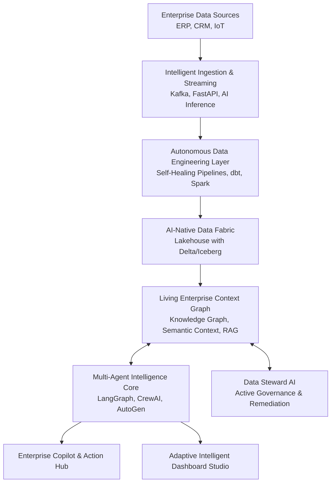

# DataNexus AI 🌌

> **The Autonomous Enterprise AI Operating System**

*"An AI-native, self-governing platform that transforms fragmented organizational data into a living, adaptive intelligence fabric — autonomously engineering data, orchestrating multi-agent reasoning, and democratizing governed decision intelligence across the enterprise."*

DataNexus AI merges the capabilities of modern data lakehouses (like Snowflake or Databricks) with advanced multi-agent orchestration and an **Enterprise Context Graph**. It serves as the autonomous nervous system for your enterprise, providing proactive, explainable, and self-healing intelligence.

---

## 🚀 Key Features

* **Intelligent Ingestion & Streaming:** AI-assisted schema inference seamlessly bringing in streaming and batch data from ERP, CRM, IoT, and more.
* **Autonomous Data Engineering Layer:** Self-healing pipelines that detect schema drift and anomalies, automatically resolving issues without manual intervention.
* **Living Enterprise Context Graph:** A real-time graph capturing business ontologies, decision traces, operational context, and causal relationships.
* **Data Steward AI (Governance Agent):** Active governance that continuously monitors for PII exposure, poor schemas, and duplicates, with autonomous remediation capabilities.
* **Multi-Agent Intelligence Core:** Departmental AI agents that collaborate and reason over the Context Graph, simulating business scenarios and proposing human-in-the-loop actions.
* **NL to Action BI & Decision Engine:** Natural Language queries translate into full reasoning chains (SQL generation -> causal explanation -> simulation -> recommended action).
* **Enterprise Knowledge & Action Copilot:** A conversational interface to securely query organizational knowledge, execute tasks, and trigger agent workflows.

---

## 🏗️ Architecture

---

## 🛠️ Tech Stack

* **Backend:** Python, FastAPI, Airflow, dbt, Spark
* **Agents & Orchestration:** LangGraph, CrewAI, AutoGen
* **Graph & Data Storage:** Neo4j, Qdrant/FAISS, Delta Lake / Iceberg (Snowflake / PostgreSQL / DuckDB)
* **Frontend:** React, TypeScript, Tailwind CSS, AG Grid, ECharts/Plotly
* **MLOps / Observability:** Docker, MLflow, Prometheus, Grafana, OpenTelemetry

---

## 📂 Project Structure

- `backend/`: Core Python backend, API endpoints, AI agents, and services.
  - `agents/`: Multi-agent definitions (Orchestrator, Steward Agent, etc.).
  - `services/`: Core logic (Ingestion, Graph mapping, NL routing, Copilot).
  - `models/`: Data schema definitions.
- `frontend/`: React + TypeScript frontend and Adaptive Dashboard Studio.
- `dags/`: Airflow directed acyclic graphs for scheduling data pipelines.
- `data_landing/`: Synthetic data and local lakehouse zones.
- `scripts/`: Initialization and utility scripts.
- `tests/`: End-to-end and unit testing suite.

---

## 📝 Implementation Timeline

This project is built across an aggressive 6-week timeframe:
1. **Week 1:** Foundation (Ingestion & AI-Native Data Fabric)
2. **Week 2:** Living Enterprise Context Graph
3. **Week 3:** Multi-Agent Intelligence Core
4. **Week 4:** NL to Action BI & Adaptive Dashboards
5. **Week 5:** Decision Intelligence & Enterprise Copilot
6. **Week 6:** Democratization, Novelty Features, & Observability

*(See `tasks (1).md` and `ARCHITECTURE.md` for full implementation details and modules.)*

---

## 🛡️ Governance & Ethical AI

DataNexus AI is built with **Explainability by Design**. Every recommendation and simulated outcome is attached to confidence metrics, risk assessments, and fully traceable lineage back to the Context Graph. Differential privacy and bias monitoring are baked into the core engine to ensure secure, compliant AI workflows.
